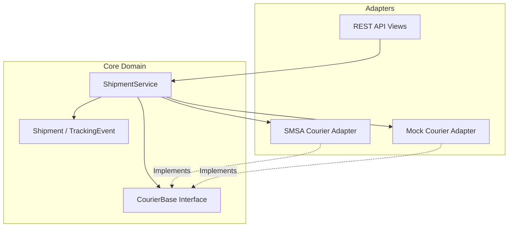

# ZidShip Courier Framework

## Overview
A unified courier integration framework designed for ZidShip to abstract multiple courier integrations behind a single, consistent interface. Built with Django and Django REST Framework.

## System Architecture

The project follows a **Hexagonal Architecture (Ports and Adapters)** to decouple the core business logic from external concerns.



## Challenge Requirements Mapping

The following table maps the requirements from the Python Coding Challenge PDF to the implementation in this project.

| Requirement | Implementation Component | File Location | Description |
| :--- | :--- | :--- | :--- |
| **Generic Interface** | `CourierBase` (Abstract Class) | `core/couriers/base.py` | Defines standard methods (`create_shipment`, `track`) that all couriers must implement. |
| **Specific Courier** | `SMSACourier` | `core/couriers/smsa.py` | Real SOAP integration with SMSA Express, constructing XML payloads for `addShipPDF`. |
| **Mock Courier** | `MockCourier` | `core/couriers/mock.py` | In-memory courier simulation for testing without external API calls. |
| **HTTP Retries** | `HTTPClient` | `core/http_client.py` | Robust HTTP wrapper with exponential backoff for handling network failures. |
| **Service Layer** | `ShipmentService` | `core/services.py` | Orchestrates validation, courier selection, api calls, and database persistence. |
| **REST API** | Django REST Framework | `core/views.py` | API endpoints to expose shipment functionality. |

## Trade-offs and Decisions

1.  **JSONB vs Normalized Tables**:
    -   *Decision*: Use `JSONField` (JSONB in Postgres) for courier-specific data.
    -   *Reason*: Couriers have highly variable metadata. Normalizing every field would lead to complex EAV patterns. JSONB offers flexibility.
2.  **Synchronous API**:
    -   *Decision*: Keep `create_shipment` synchronous for MVP.
    -   *Reason*: Simplicity. In production, this should be offloaded to Celery tasks to handle high throughput.
3.  **Code-based Configuration**:
    -   *Decision*: Registry pattern in `CourierFactory`.
    -   *Reason*: Easier to test and maintain than database-stored logic configuration.

## Setup Instructions

1.  **Install Dependencies**:
    ```bash
    pip install -r requirements.txt
    ```

2.  **Run Migrations**:
    ```bash
    python manage.py makemigrations core
    python manage.py migrate
    ```

3.  **Run Server**:
    ```bash
    python manage.py runserver
    ```

## 🧪 Testing & Usage Guide

### 1. Automated Tests

**Run all Unit Tests (Core + SMSA):**
```bash
python manage.py test core
```

**Run only SMSA SOAP Integration Tests:**
```bash
python manage.py test core.tests_smsa
```

**Run Full Integration Scenario (Create -> Track -> Cancel):**
```bash
python manage.py test_integration
```

### 2. Manual Testing (Functionality Examples)

You can test the API using `curl` or Postman. Ensure the server is running: `python manage.py runserver`

#### A. List Available Couriers
```bash
curl -X GET http://localhost:8000/api/v1/couriers/
```

#### B. Create a Shipment
```bash
curl -X POST http://localhost:8000/api/v1/shipments/ \
  -H "Content-Type: application/json" \
  -d '{
    "reference_number": "ORDER-1001",
    "courier_provider": "MOCK", 
    "sender": {
      "name": "Zid Store",
      "address_line1": "Riyadh Business Gate",
      "city": "Riyadh",
      "country": "SA",
      "phone": "+966500000000"
    },
    "recipient": {
      "name": "Saeed Customer",
      "address_line1": "King Abdulaziz Road",
      "city": "Jeddah",
      "country": "SA",
      "phone": "+966511111111"
    },
    "package": {
      "weight": 2.5,
      "description": "Mobile Phone",
      "value": 3000
    }
  }'
```
*Response will contain a `waybill_number` (e.g., `MOCK...`). Use this for subsequent requests.*

#### C. Track a Shipment
```bash
curl -X GET http://localhost:8000/api/v1/shipments/<WAYBILL_NUMBER>/track/
```

#### D. Print Label
```bash
curl -X GET http://localhost:8000/api/v1/shipments/<WAYBILL_NUMBER>/label/
```

#### E. Cancel Shipment
```bash
curl -X DELETE http://localhost:8000/api/v1/shipments/<WAYBILL_NUMBER>/cancel/ \
  -H "Content-Type: application/json" \
  -d '{"reason": "Customer changed mind"}'
```

### 3. Testing SMSA Integration specifically
To test the real SMSA SOAP generation logic (without sending to the production server), we have created a dedicated test suite.

**File**: `core/tests_smsa.py`

**What it tests**:
1.  **XML Construction**: Verifies that the internal DTOs are correctly converted into the SOAP XML format expected by SMSA.
2.  **Response Parsing**: Verifies that the system can correctly parse a standard SMSA XML response.
3.  **Error Handling**: Ensures that SOAP faults or API errors are caught and converted to standard `errors` list.

**Run it:**
```bash
python manage.py test core.tests_smsa
```

## Documentation

- **API Docs**: Visit `/api/v1/docs/` after starting the server.
- **Architecture**: See `architecture.md` for detailed diagrams and interview guide.
