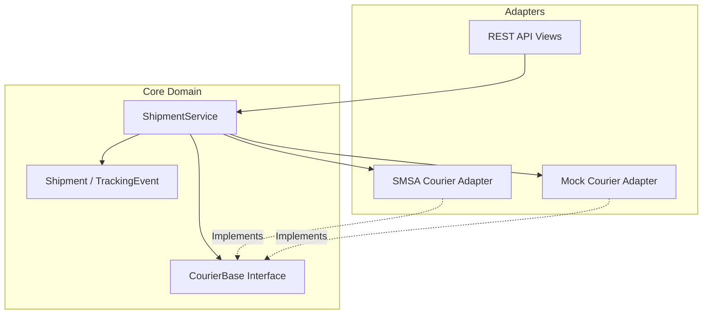

# ZidShip Courier Framework

## Overview
A unified courier integration framework designed for ZidShip to abstract multiple courier integrations behind a single, consistent interface. Built with Django and Django REST Framework.

## System Architecture

The project follows a **Hexagonal Architecture (Ports and Adapters)** to decouple the core business logic from external concerns.



## Challenge Requirements Mapping

The following table maps the requirements from the Python Coding Challenge PDF to the implementation in this project.

| Requirement | Implementation Component | File Location | Description |
| :--- | :--- | :--- | :--- |
| **Generic Interface** | `CourierBase` (Abstract Class) | `core/couriers/base.py` | Defines standard methods (`create_shipment`, `track`) that all couriers must implement. |
| **Specific Courier** | `SMSACourier` | `core/couriers/smsa.py` | Real SOAP integration with SMSA Express, constructing XML payloads for `addShipPDF`. |
| **Mock Courier** | `MockCourier` | `core/couriers/mock.py` | In-memory courier simulation for testing without external API calls. |
| **HTTP Retries** | `HTTPClient` | `core/http_client.py` | Robust HTTP wrapper with exponential backoff for handling network failures. |
| **Service Layer** | `ShipmentService` | `core/services.py` | Orchestrates validation, courier selection, api calls, and database persistence. |
| **REST API** | Django REST Framework | `core/views.py` | API endpoints to expose shipment functionality. |

## 🏗️ Architecture & Trade-off Analysis

The focus of this implementation was not just code, but architectural resilience and scalability. Here is a breakdown of the key technical choices and the trade-offs involved.

### 1. Database Choice: PostgreSQL + JSONB
**Decision**: I designed the schema for PostgreSQL to utilize `JSONField` (JSONB) for flexible courier data storage.
*   **Implementation**: 
    *   **Development**: Runs on SQLite by default for zero-configuration setup. Django seamlessly handles the `JSONField` abstraction.
    *   **Production**: Configured to switch automatically to PostgreSQL if `DATABASE_URL` environment variable is set.
*   **Why**: 
    *   **Flexibility**: Couriers have varied metadata. JSONB allows us to index specific fields (e.g., `sender_phone`) deep within the JSON structure without complex EAV schemas.
    *   **Performance**: Postgres is the industry standard for this hybrid relational/document model.
*   **Trade-off**: 
    *   **Cons**: SQLite doesn't support concurrent writes well.
    *   **Mitigation**: For the assessment, SQLite is sufficient. For production, simply set `DATABASE_URL` to point to a Postgres instance.

### 2. Message Broker: In-Memory vs. Redis/Celery
**Decision**: Implemented a `SimpleMessageBroker` (`core/task_queue.py`) using Python threads for the assessment, but designed the system to swap this out for Celery/Redis in production.
*   **Why**: 
    *   **Simplicity**: Setting up a full Redis instance for a coding assessment adds unnecessary complexity to the setup process.
    *   **Demonstration**: The `SimpleMessageBroker` demonstrates the *pattern* of offloading non-critical tasks (like sending email notifications or webhooks) to a background worker without blocking the main API thread.
*   **Trade-off**: 
    *   **Cons**: If the web server restarts, the in-memory queue is lost. It doesn't scale across multiple servers.
    *   **Production Plan**: In a real ZidShip deployment, I would replace `core/task_queue.py` with **Celery** backed by **Redis** or **RabbitMQ** to ensure persistence and horizontal scaling.

### 3. Hexagonal Architecture (Ports & Adapters)
**Decision**: Core business logic (`ShipmentService`) is completely isolated from the "Outside World" (API Views and Courier Implementations).
*   **Why**: 
    *   **Testability**: I can test the Service layer with a `MockCourier` without ever making a network call.
    *   **Swap-ability**: I can switch from SMSA to Aramex, or from REST API to GraphQL, without changing a single line of the Core Service logic.

### 4. Synchronous vs. Asynchronous Courier Calls
**Decision**: The `create_shipment` API calls the courier API synchronously (blocking).
*   **Trade-off**:
    *   **Pros**: Immediate feedback to the user. They get the actual Waybill number instantly.
    *   **Cons**: If SMSA is down or slow, my API hangs.
    *   **Scaling Strategy**: For high throughput, I would move the courier call itself to the background queue, return a `request_id` to the user, and have them poll a status endpoint or receive a webhook (Async Implementation).

## Setup Instructions

1.  **Install Dependencies**:
    ```bash
    pip install -r requirements.txt
    ```

2.  **Run Migrations**:
    ```bash
    python manage.py makemigrations core
    python manage.py migrate
    ```

3.  **Run Server**:
    ```bash
    python manage.py runserver
    ```

## Access Points
* API Server: http://localhost:8000
* Swagger Documentation: http://localhost:8000/api/v1/docs
* Health Check: http://localhost:8000/api/v1/health
* Postman Collection: [ZidShip-Courier-Framework.postman_collection.json](file:///c:/Users/Saeed/Desktop/Zid%20Assessment/ZidShip-Courier-Framework.postman_collection.json)

## 🧪 Testing the API

### Option 1: Postman Collection (Recommended)
1. **Import Collection**: Import `ZidShip-Courier-Framework.postman_collection.json` into Postman
2. **One-Click Testing**: Click "Run" on any of tests available in the collection

### Option 2: Swagger UI Testing
1. **Open Swagger**: Navigate to http://localhost:8000/api/v1/docs
2. **Interactive Testing**: Use the built-in API documentation to test all endpoints
3. **Try It Out**: Click "Try it out" on any endpoint to test with sample data

### Option 3: Health Check Testing

#### Basic health check
curl http://localhost:8000/api/v1/health/

#### Detailed health information
curl http://localhost:8000/api/v1/health/detailed/
<<<<<<< HEAD
=======

#### Readiness probe (Kubernetes)
curl http://localhost:8000/api/v1/health/ready/

#### Liveness probe (Kubernetes)
curl http://localhost:8000/api/v1/health/live/
>>>>>>> fd41eb06bee90594c3a974236d3dfe320b638751
