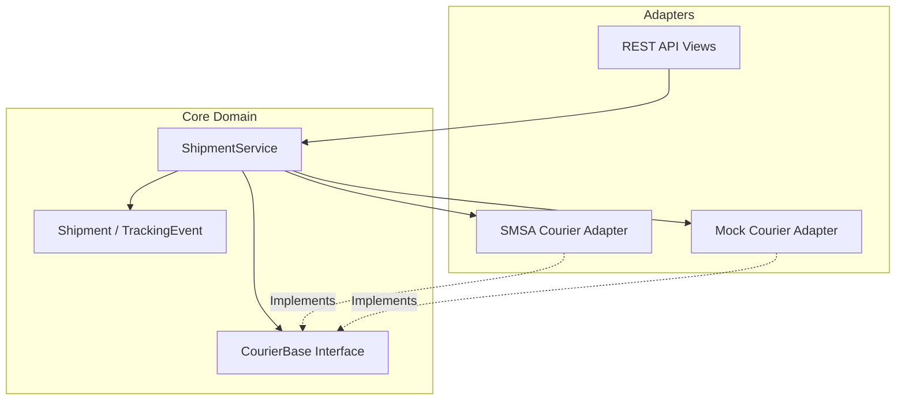

# ZidShip Courier Framework

## Overview
A unified courier integration framework designed for ZidShip to abstract multiple courier integrations behind a single, consistent interface. Built with Django and Django REST Framework.

## System Architecture

The project follows a **Hexagonal Architecture (Ports and Adapters)** to decouple the core business logic from external concerns.



## Challenge Requirements Mapping

The following table maps the requirements from the Python Coding Challenge PDF to the implementation in this project.

| Requirement | Implementation Component | File Location | Description |
| :--- | :--- | :--- | :--- |
| **Generic Interface** | `CourierBase` (Abstract Class) | `core/couriers/base.py` | Defines standard methods (`create_shipment`, `track`) that all couriers must implement. |
| **Specific Courier** | `SMSACourier` | `core/couriers/smsa.py` | Real SOAP integration with SMSA Express, constructing XML payloads for `addShipPDF`. |
| **Mock Courier** | `MockCourier` | `core/couriers/mock.py` | In-memory courier simulation for testing without external API calls. |
| **HTTP Retries** | `HTTPClient` | `core/http_client.py` | Robust HTTP wrapper with exponential backoff for handling network failures. |
| **Service Layer** | `ShipmentService` | `core/services.py` | Orchestrates validation, courier selection, api calls, and database persistence. |
| **REST API** | Django REST Framework | `core/views.py` | API endpoints to expose shipment functionality. |

## Trade-offs and Decisions

1.  **JSONB vs Normalized Tables**:
    -   *Decision*: Use `JSONField` (JSONB in Postgres) for courier-specific data.
    -   *Reason*: Couriers have highly variable metadata. Normalizing every field would lead to complex EAV patterns. JSONB offers flexibility.
2.  **Synchronous API**:
    -   *Decision*: Keep `create_shipment` synchronous for MVP.
    -   *Reason*: Simplicity. In production, this should be offloaded to Celery tasks to handle high throughput.
3.  **Code-based Configuration**:
    -   *Decision*: Registry pattern in `CourierFactory`.
    -   *Reason*: Easier to test and maintain than database-stored logic configuration.

## Setup Instructions

1.  **Install Dependencies**:
    ```bash
    pip install -r requirements.txt
    ```

2.  **Run Migrations**:
    ```bash
    python manage.py makemigrations core
    python manage.py migrate
    ```

3.  **Run Server**:
    ```bash
    python manage.py runserver
    ```

## Testing

- **Unit Tests**:
    ```bash
    python manage.py test core
    ```
- **Integration Scenario**:
    ```bash
    python manage.py test_integration
    ```

## Documentation
- **API Docs**: Visit `/api/v1/docs/` after starting the server.
- **Architecture**: See `architecture.md` for detailed diagrams and interview guide.
