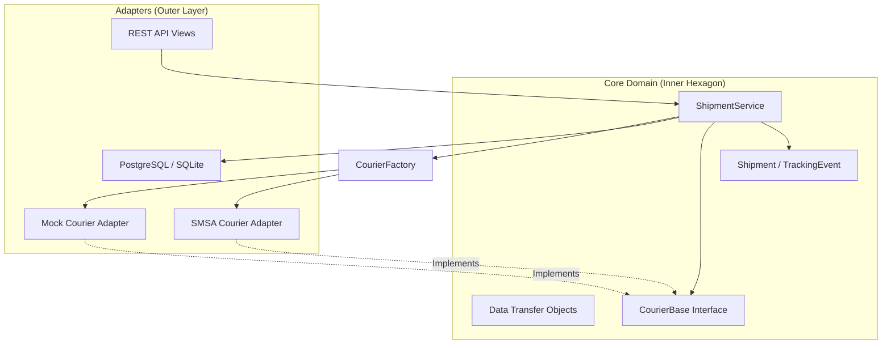
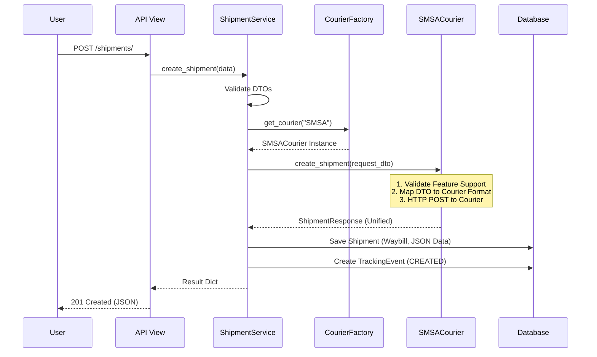
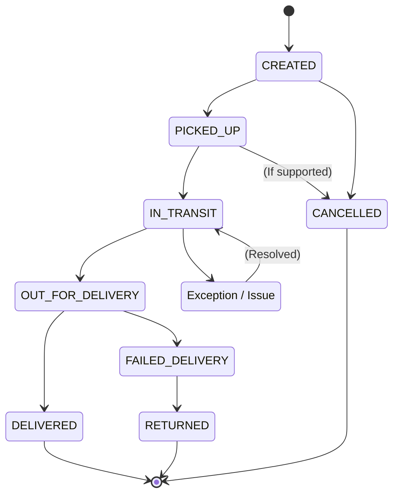

# ZidShip Courier Framework - Architecture & Interview Guide

## 1. System Architecture

The project follows a **Hexagonal Architecture (Ports and Adapters)** to decouple the core business logic from external concerns (like specific courier APIs or the web framework).

### Key Components

1.  **Core/Domain Layer**:
    *   **Models**: `Shipment`, `TrackingEvent`. Persistent state.
    *   **DTOs**: `ShipmentRequest`, `ShipmentResponse`. Type-safe data exchange.
    *   **Interfaces**: `CourierBase`. The "Port" that defines how we talk to *any* courier.
    *   **Services**: `ShipmentService`. Orchestrates the logic (Validation -> Factory -> Courier Adapter -> DB Save).

2.  **Adapters Layer**:
    *   **Courier Adapters**: `SMSACourier`, `MockCourier`. Implementation details for specific providers.
    *   **Web Adapter**: Django Views & Serializers. Handles HTTP, parsing, and formatting.

---

## 2. Key Design Patterns

You should mention these in your interview:

1.  **Strategy Pattern**: `CourierBase` is the strategy interface. `SMSACourier` and `MockCourier` are concrete strategies. The system works with the interface, not the concrete classes.
2.  **Factory Pattern**: `CourierFactory` decides *which* courier strategy to instantiate based on the `provider` string or business rules (e.g., "Best for Saudi").
3.  **Adapter Pattern**: Each courier class adapts the 3rd-party API's specific request/response format into our unified `ShipmentRequest`/`ShipmentResponse` format.
4.  **Repository Pattern (Implicit)**: Django's ORM (`Shipment.objects`) acts as our data repository.

---

## 3. Process Flows (Sequence Diagrams)

### Scenario: Creating a Shipment

This is the most complex flow. Walk the interviewer through this:

---

## 4. State Management

We use a standard set of statuses (`UnifiedStatus`) to map the chaotic vendor statuses to ours.

---

## 5. How to Answer: "Add a New API"

**Scenario**: "The business wants a new endpoint `GET /shipments/rates` to calculate shipping costs *before* creating a shipment."

### Step-by-Step Implementation Guide

1.  **Update the Interface (`CourierBase`)**:
    *   Add a new abstract method `get_shipping_rate(self, request: RateRequest) -> RateResponse`.
    *   *Why?* Because calculating rates is a courier-specific operation.

2.  **Update DTOs (`core/dtos.py`)**:
    *   Create `RateRequest` (weight, dimensions, origin, destination).
    *   Create `RateResponse` (cost, currency, expected_delivery).

3.  **Implement in Adjusters (`core/couriers/smsa.py`)**:
    *   Implement the `get_shipping_rate` method in `SMSACourier` and `MockCourier`.
    *   Perform the specific API call to the courier to get rates.

4.  **Update Service Layer (`core/services.py`)**:
    *   Add `ShipmentService.calculate_rate(data)`.
    *   This method should validate input, call `CourierFactory` to get the provider, and call `courier.get_shipping_rate`.

5.  **Expose via API**:
    *   **Serializer**: Create `RateRequestSerializer` and `RateResponseSerializer` in `core/serializers.py`.
    *   **View**: Add `calculate_rate` function-based view in `core/views.py`.
    *   **URL**: Add `path("shipments/rates/", ...)` in `core/urls.py`.

### Interview Answer Template

> "To add a Rate Calculation API, I would follow adherence to the Hexagonal Architecture:
> 1.  **Define the Interface**: I'd first define a `get_rate` method in our `CourierBase` contract and create standard DTOs for the request and response.
> 2.  **Implement Adapters**: I'd implement this method in our specific courier classes (SMSA, Aramex), handling their specific API quirks.
> 3.  **Service Integration**: I'd expose this through the `ShipmentService`, adding logic to perhaps query multiple couriers and return the cheapest option.
> 4.  **API Layer**: Finally, I'd create a Serializer and View to expose this service method via REST."

---

## 6. How to Extend: Adding a New Courier (e.g., DHL)

1.  **Create Adapter**: Create `core/couriers/dhl.py`.
2.  **Inherit**: Class `DHLCourier(CourierBase)`.
3.  **Implement**: Implement all abstract methods (`create_shipment`, `track`, etc.).
4.  **Map Statuses**: Define `STATUS_MAP` for DHL -> `UnifiedStatus`.
5.  **Register**: Add `CourierProvider.DHL` enum and register in `CourierFactory._registry`.
6.  **Config**: Add DHL credentials to `settings.py`.
